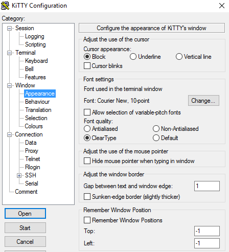
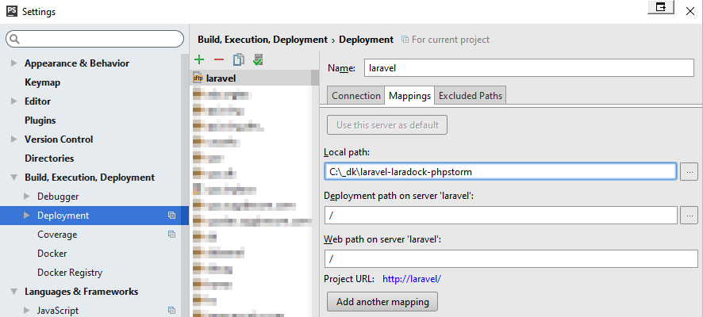
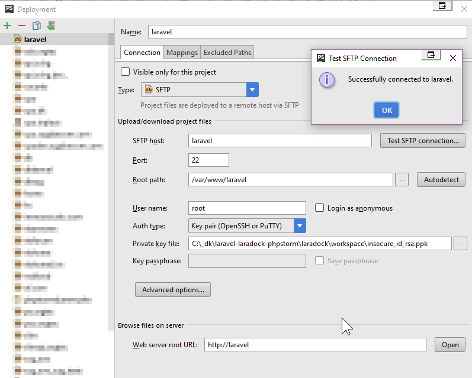
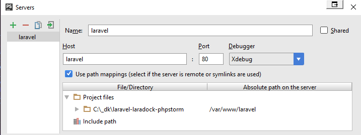

# laravel-laradock-phpstorm
Wiring up [Laravel](https://laravel.com/), [LaraDock](https://github.com/LaraDock/laradock) [Laravel+Docker] and [PHPStorm](https://www.jetbrains.com/phpstorm/) to play nice together complete with remote xdebug'ing as icing on top!


- [Intro](#Intro)
- [Installation](#Installation)
    - [Windows](#InstallWindows) 
    - [Docker](#InstallDocker) 
    - [Laravel](#InstallLaravel) 
    - [LaraDock](#InstallLaraDock) 
        - [Customized php-fpm](#CustomizePHP-FPM) 
        - [Customized workspace](#CustomizeWorkspace) 
        - [Customized laradock/docker-compose.yml](#CustomizeDockerCompose) 
        - [Clean House](#InstallCleanHouse) 
        - [LaraDock Dial Tone](#InstallLaraDockDialTone) 
        - [SSH into php-fpm](#InstallLaraDockSSH) 
            - [KiTTY](#InstallKiTTY) 
    - [PHPStorm](#InstallPHPStorm)
        - [Configs](#InstallPHPStormConfigs)
- [Usage](#Usage)
    - [Laravel](#UsageLaravel) 
        - [Run ExampleTest](#UsagePHPStormRunExampleTest) 
        - [Debug ExampleTest](#UsagePHPStormDebugExampleTest) 
        - [Debug Web Site](#UsagePHPStormDebugSite) 

<a name="Intro"></a>
## Intro
Goal is to put together a sample Laravel project running on very slightly extended version LaraDock that can run in a development environment complete with remote debugging. 

I am running with Docker Native Windows.

<a name="Installation"></a>
## Installation
This project assumes experience and familiarity with Laravel, Laradock and PHPStorm before proceeding. 
The purpose of this project is to focus on how to get these three projects to work together in a PHPStorm development workflow.


<a name="InstallWindows"></a>
### Windows
#### [Hosts File Editor](http://hostsfileeditor.codeplex.com/)
- Hosts File Editor makes it easy to change your hosts file as well as archive multiple versions for easy retrieval.
    - Set `llpLaravel` to your docker host IP.

<a name="InstallDocker"></a>
### Docker


<a name="InstallLaravel"></a>
### Laravel

Install Laravel somewhere. See from perspective of [LaraDock Installation](https://github.com/LaraDock/laradock#Installation).

- Example with [Laravel Installer](https://laravel.com/docs/5.2#installing-laravel)
`laravel new laravel-laradock-phpstorm`

#### Create a GIT repo
- [Create a new repository](https://github.com/new)
```
cd laravel new laravel-laradock-phpstorm
git init
git add .
git  commit -m "first commit"
git remote add origin git@github.com:LarryEitel/laravel-laradock-phpstorm.git
git push -u origin master
```

<a name="InstallLaraDock"></a>
### Laradock
Since we will using LaraDock as a submodule,
```
# /c/_dk/laravel-laradock-phpstorm
git submodule add https://github.com/LaraDock/laradock.git
cd laradock

Since we will be hacking a bit on this, need to preserve refactoring with parent repo. So I will remote .git.
rm -rf .git*

```


<a name="CustomizePHP-FPM"></a>
#### Customize php-fpm
- Create new file
    ```
    php-fpm/xdebug.ini
    ```
    Insert:
    ```
    zend_extension=xdebug.so
    xdebug.remote_autostart=1
    xdebug.remote_enable=1
    xdebug.remote_handler=dbgp
    xdebug.remote_mode=req
    xdebug.remote_port=9000
    xdebug.remote_host=dockerhost // will be set in docker-compose
    xdebug.idekey=PHPSTORM
    ```
    
- Edited Dockerfile-56 and Dockerfile-70
    Added:
    ```
    COPY ../xdebug.ini /usr/local/etc/php/conf.d/docker-php-ext-xdebug.ini
    ```

<a name="CustomizeWorkspace"></a>
#### Customize workspace
The LaraDock workspace container is based on [phusion/baseimage-docker](https://github.com/phusion/baseimage-docker).
This image provides support out of the box for `SSH` although it is not enabled by default. Be sure to read their docs on this at: 
[Login to the container, or running a command inside it, via SSH](https://github.com/phusion/baseimage-docker#login_ssh).

I have created 'vm' keys for this purpose. These are `.gitignore`'d with `**/id_rsa*`

- If you are following along with my approach, create these keys copy them into the `workspace` directory. Note the `_vm` in their name. 
    - `id_rsa_vm`
    - `id_rsa_vm.pub`
    
    - Note that if you use a putty client to shell into your `workspace` container, you will have to use puttygen to convert `id_rsa_vm` `id_rsa_vm.ppk`.


- Edited Dockerfile
Added the following:
```
#--------------------------------------------------------------------------
# ADDED for PHPStorm debugging
# NOTE: The following assumes PHP 7.0, change as needed for 5.6
#--------------------------------------------------------------------------
COPY ../xdebug.ini /etc/php/7.0/cli/conf.d/docker-xdebug.ini


#--------------------------------------------------------------------------
# ADDED for PHPStorm debugging
# phusion/baseimage:latest
# See: https://github.com/phusion/baseimage-docker#enabling_ssh
#--------------------------------------------------------------------------
RUN rm -f /etc/service/sshd/down


#--------------------------------------------------------------------------
# ADDED for PHPStorm debugging
#--------------------------------------------------------------------------
ADD id_rsa_vm /tmp/id_rsa
ADD id_rsa_vm.pub /tmp/id_rsa.pub
RUN cat /tmp/id_rsa.pub >> /root/.ssh/authorized_keys \
    && cat /tmp/id_rsa.pub >> /root/.ssh/id_rsa.pub \
    && cat /tmp/id_rsa >> /root/.ssh/id_rsa \
    && rm -f /tmp/id_rsa* \
    && chmod 644 /root/.ssh/authorized_keys /root/.ssh/id_rsa.pub \
    && chmod 400 /root/.ssh/id_rsa

```


### Edited laradock/docker-compose.yml

<a name="CustomizeDockerCompose"></a>
#### Customize laradock/docker-compose.yml
**TODO**: Need to set your docker host IP for php-fpm container.

#### Workspace Utilities Container
- Set: INSTALL_XDEBUG=true
- Added
```
extra_hosts:
    # insert your docker host IP
    # this will be appended to php-fpm container /etc/hosts
    # TODO: Replace with your Docker Host IP
    - "dockerhost:10.0.75.1"
ports:
   - "22:22"
```   

#### PHP-FPM Container
- Set: INSTALL_XDEBUG=true
- Added
```
extra_hosts:
    # insert your docker host IP
    # this will be appended to php-fpm container /etc/hosts
    # TODO: Replace with your Docker Host IP
    - "dockerhost:10.0.75.1"
environment:
    # IMPORTANT: You must have a Remote Interpreter entry matching this name
    - PHP_IDE_CONFIG="serverName=llpLaravel"
```   


- If your containers are currently running, let's give it a restart.
`docker-compose up -d mysql nginx`


<a name="InstallCleanHouse"></a>
### Need to clean house first?
Make sure you are starting with a clean state. For example, do you have other LaraDock containers and images?
Here are a few things I use to clean things up.

- Delete all containers using `grep laradock` on the names, see: [Remove all containners based on docker image name](https://linuxconfig.org/remove-all-containners-based-on-docker-image-name). 
`docker ps -a | awk '{ print $1,$2 }' | grep laradock | awk '{print $1}' | xargs -I {} docker rm {}`

- Delete all images containing `laradock`.
`docker images | awk '{print $1,$2,$3}' | grep laradock | awk '{print $3}' | xargs -I {} docker rmi {}`
**Note:** Some may fail with: 
`Error response from daemon: conflict: unable to delete 3f38eaed93df (cannot be forced) - image has dependent child images`

- I added this to my `.bashrc` to remove orphaned images.
    ```
    dclean() {
        processes=`docker ps -q -f status=exited`
        if [ -n "$processes" ]; thend
          docker rm $processes
        fi
    
        images=`docker images -q -f dangling=true`
        if [ -n "$images" ]; then
          docker rmi $images
        fi
    }
    ```

<a name="InstallLaraDockDialTone"></a>
#### Let's get a dial-tone with Laravel

```
# barebones at this point
docker-compose up -d nginx mysql

# run 
docker-compose ps

# Should see:
laradock_mysql_1            docker-entrypoint.sh mysqld   Up       0.0.0.0:3306->3306/tcp
laradock_nginx_1            nginx                         Up       0.0.0.0:443->443/tcp, 0.0.0.0:80->80/tcp
laradock_php-fpm_1          php-fpm                       Up       9000/tcp
laradock_volumes_data_1     true                          Exit 0
laradock_volumes_source_1   true                          Exit 0
laradock_workspace_1        /sbin/my_init                 Up       0.0.0.0:22->22/tcp


```

- If you have run LaraDock on other projects, you MAY encounter this issue: [Plugin 'InnoDB' registration as a STORAGE ENGINE failed.](https://github.com/LaraDock/laradock/issues/202)

<a name="InstallLaraDockSSH"></a>
#### Let's shell into php-fpm
Assuming that you are in laradock folder.
`ssh -i  workspace/id_rsa_vm root@docker`

<a name="InstallKiTTY"></a>
**Cha Ching!!!!**
##### KiTTY
[Kitty](http://www.9bis.net/kitty/) KiTTY is a fork from version 0.67 of PuTTY.

- Here are some settings that are working for me:
    - 
    - 
    - 
    - 
    - 
    - 
    - 
    - 


<a name="InstallPHPStorm"></a>
### PHPStorm
- File/New Project

`dockerhost` was added to `etc/hosts` and points to `Docker Host IP`.


    - 
Yes

<a name="InstallPHPStormConfigs"></a>
#### Configs
- Here are some settings that work:
    - `Settings/BuildDeploymentConnectionMappings`
        - 
    
    - `Settings/DeploymentConnection`
        - 
    
    - `Settings/LangsPHPInterpreters`
        - 
    
    - `Settings/LangsPHPPHPUnit`
        - 
    
    - `Settings/EditRunConfigurations`
        - 
    
    - `Settings/LangsPHPServers`
        - 
    
    - `RemoteHost`
        - 


<a name="Usage"></a>
## Usage

<a name="UsagePHPStorm"></a>
## PHPStorm
<a name="UsagePHPStormRunExampleTest"></a>
### Run ExampleTest
- right-click on `tests/ExampleTest.php`
    - Select: `Run 'ExampleTest.php'` or `Ctrl+Shift+F10`.
    - Should pass!! You just ran a remote test via SSH!

<a name="UsagePHPStormDebugExampleTest"></a>
### Debug ExampleTest
- Open to edit: `tests/ExampleTest.php`
- Add a BreakPoint on line 16: `$this->visit('/')`
- right-click on `tests/ExampleTest.php`
    - Select: `Debug 'ExampleTest.php'`.
    - Should have stopped at the BreakPoint!! You are now debugging locally against a remote Laravel project via SSH!


<a name="UsagePHPStormDebugSite"></a>
### Debug WebSite
- Start Remote Debugging
    -  
- Open to edit: `bootstrap/app.php`
- Add a BreakPoint on line 14: `$app = new Illuminate\Foundation\Application(`
- Reload [Laravel Site](http://llplaravel/)
    - Should have stopped at the BreakPoint!! You are now debugging locally against a remote Laravel project via SSH!
